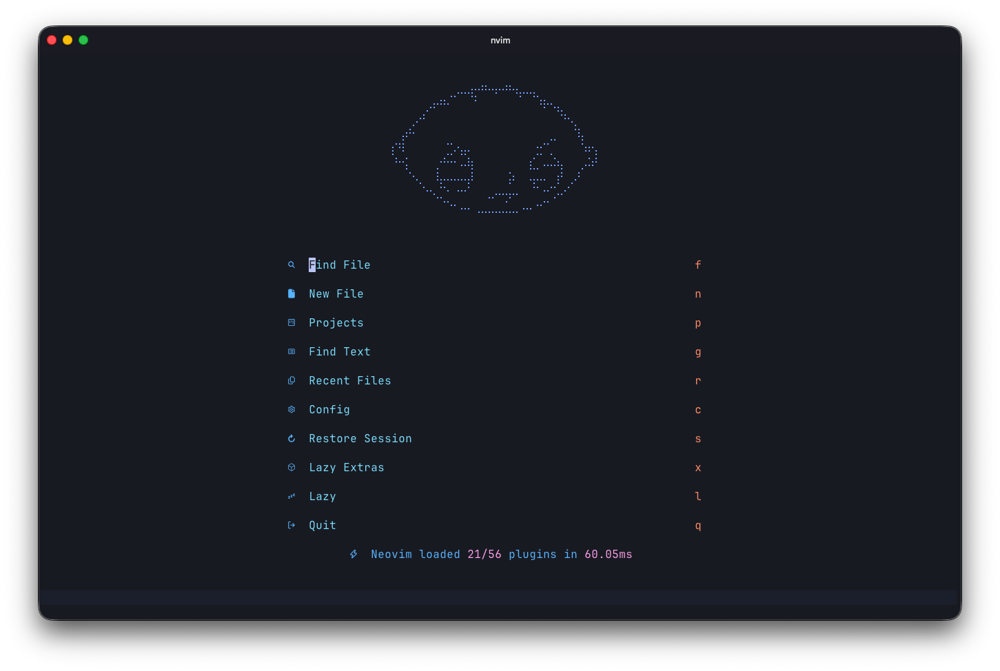
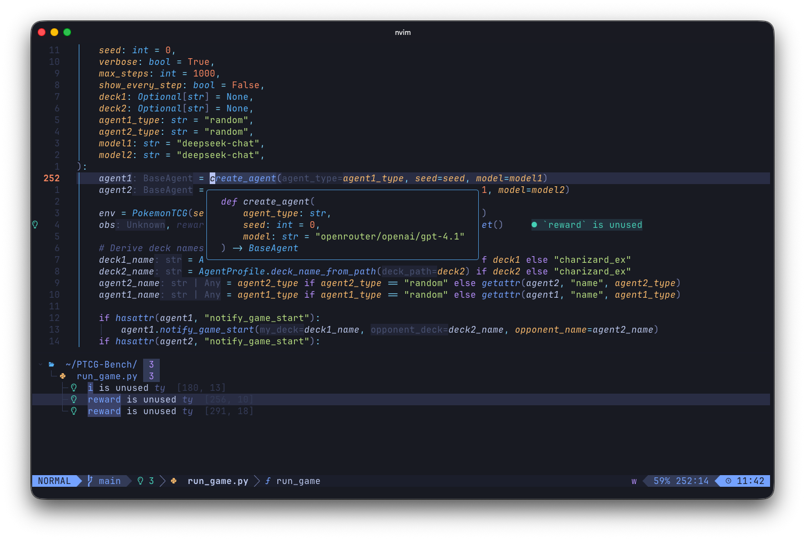
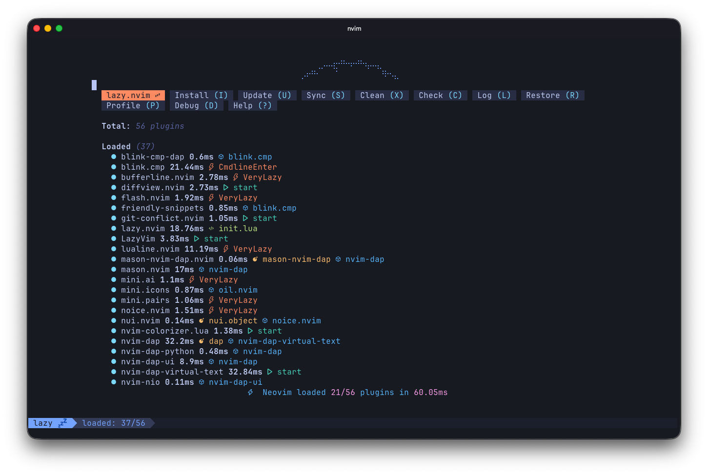

# Neovim Config

A personal Neovim setup built on top of [LazyVim](https://github.com/LazyVim/LazyVim). It is tuned for a keyboard-first workflow across Python, systems languages, writing, debugging, Git, and AI-assisted editing.



## Highlights

- **LazyVim foundation** with a small, modular plugin layout in `lua/plugins/`.
- **Python workflow** with `ty`, `ruff`, LazyVim's Python extra, rounded LSP docs, and `blink.cmp` completion.
- **AI assistance** through [copilot.lua](https://github.com/zbirenbaum/copilot.lua) and [claude-code.nvim](https://github.com/greggh/claude-code.nvim).
- **Debugging** with [nvim-dap](https://github.com/mfussenegger/nvim-dap), [nvim-dap-ui](https://github.com/rcarriga/nvim-dap-ui), and completion inside the DAP REPL.
- **Writing support** for Markdown, LaTeX, and Typst, including GitHub-style Markdown preview, VimTeX, Skim integration, and Typst live preview.
- **Navigation and project flow** with Oil, Yazi, tmux pane navigation, Bufferline tabs, Diffview, and Git conflict helpers.
- **Polished UI** using transparent Tokyonight, Noice borders, Snacks dashboard customization, color previews, and Tailwind completion colors.

## Screenshots

| Python editing and diagnostics | Lazy plugin manager |
| --- | --- |
|  |  |

## Requirements

- Neovim 0.11.2 or newer.
- Git and a working C/C++ toolchain for plugins that compile native code.
- Optional but recommended:
  - `ripgrep` and `fd` for fast search.
  - `yazi` for the floating file manager integration.
  - `tmux` for seamless pane navigation.
  - `ruff` and `ty` for the Python setup.
  - `latexmk`, XeLaTeX, and Skim on macOS for VimTeX.
  - `typst` for Typst preview workflows.
  - GitHub Copilot authentication if you want inline AI suggestions.

## Installation

Back up any existing Neovim config first:

```bash
mv ~/.config/nvim ~/.config/nvim_backup
```

Clone this repository:

```bash
git clone https://github.com/gemelom/nvim-config ~/.config/nvim
```

Start Neovim and let Lazy install the plugins:

```bash
nvim
```

Then run health checks if something does not load as expected:

```vim
:checkhealth
:Lazy
```

## Key Bindings

These are the custom bindings added by this repo on top of LazyVim defaults.

| Key | Action |
| --- | --- |
| `<Tab>` / `<S-Tab>` | Cycle Bufferline tabs |
| `<C-h>` / `<C-j>` / `<C-k>` / `<C-l>` | Move between Neovim and tmux panes |
| `<leader>-` | Open Yazi at the current file |
| `<leader>cw` | Open Yazi in the current working directory |
| `<C-Up>` | Resume the last Yazi session |
| `<leader>ac` | Toggle Claude Code |
| `<M-Enter>` | Accept Copilot inline suggestion |
| `<M-]>` / `<M-[>` | Cycle Copilot suggestions |
| `<leader>do` / `<leader>dO` | DAP step over / step out |
| `<leader>mp` | Toggle GitHub Markdown preview |
| `<leader>mps` | Toggle single-file Markdown preview |
| `<leader>mpd` | Toggle Markdown details tags |
| `<leader>tp` | Start Typst preview |
| `<leader>im` | Toggle English/Chinese input method through `im-select.exe` |

## Structure

```text
.
├── init.lua
├── lazyvim.json
├── lua
│   ├── config
│   │   ├── autocmds.lua
│   │   ├── keymaps.lua
│   │   ├── lazy.lua
│   │   └── options.lua
│   └── plugins
│       ├── ai.lua
│       ├── dap.lua
│       ├── editor.lua
│       ├── git.lua
│       ├── lsp.lua
│       ├── markdown.lua
│       ├── typst.lua
│       ├── ui.lua
│       └── ...
└── assets
    └── screenshots
```

## Updating

Use Lazy's built-in UI:

```vim
:Lazy
```

Or sync from the command line:

```bash
nvim --headless "+Lazy! sync" +qa
```

Plugin versions are pinned in `lazy-lock.json`.

## Notes

- `pyright` is intentionally disabled in `lua/plugins/lsp.lua`; the active Python LSP path is `ty` plus `ruff`.
- `vimtex` is configured for Skim and XeLaTeX.
- The input-method toggle expects `im-select.exe`, which is useful for WSL/Windows-style environments.

## License

MIT. See [LICENSE.md](LICENSE.md).
